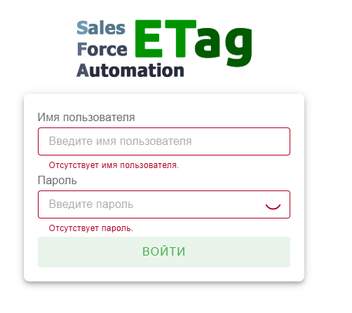
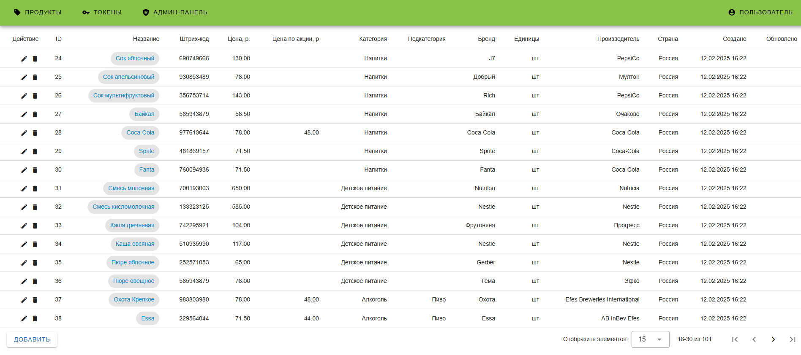
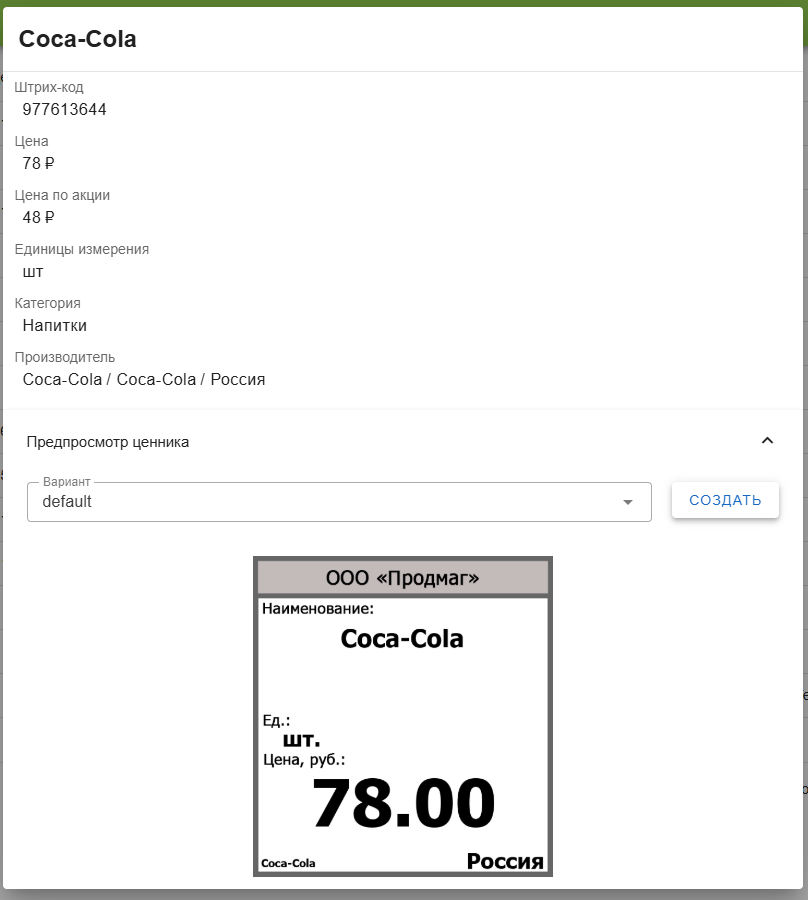

# Etag-SFA

Курсовой проект по разработке системы управления электронными ценниками **(только веб часть)**.

## Сборка проекта

1.  Клонировать этот репозиторий

```bash
git clone https://github.com/VerS7/etag-sfa
```

2. Перейти в директорию проекта

```bash
cd etag-sfa
```

3. Заполнить **.env** файл с конфигурацией

4. Сборка и запуск через make & docker compose

```bash
make run-build
```

### Конфигурация

-   **DB_USERNAME**

    -   Имя пользователя базы данных.

-   **DB_PASSWORD**

    -   Пароль пользователя базы данных.

-   **DB_URL**

    -   URL базы данных.

-   **DB_NAME**

    -   Название базы данных.

-   **ADMIN_USERNAME**

    -   Имя _нулевого_ администратора.

-   **ADMIN_PASSWORD**

    -   Пароль _нулевого_ администратора.

### Mock

Для наполнения системы **mock**-данными написан **faker**.

### Использование faker

1. Перейти в директорию **faker/**

```bash
cd faker
```

2. Установить **requests**

```bash
pip install requests
```

3. Заполнить **.env** файл с конфигурацией

4. Запустить **faker**

```bash
python main.py
```

## Использование веб-приложения

Как только запущен **docker compose**, можно перейти по URL http://localhost и посмотреть проект.

### Форма входа



### Интерфейс приложения



### Превью ценника


